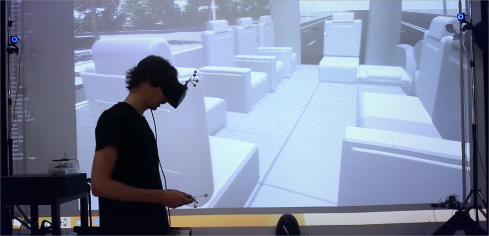
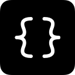
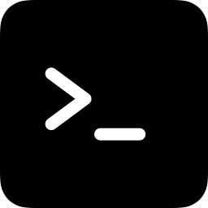

Welcome to the MR Platform wiki! The Collaborative MR Platform of CDI is a research platform that supercharges virtual reality with **physical-virtual object correspondence** and **multi-user collaboration** capabilities. This is achieved by combining motion tracking with VR using custom software in Unity, which supports a wide variety of research cases.

## A first look
Before you get started at developing your application, it's better to take a look at the [platform architecture](https://github.com/tongji-cdi/mr-platform/wiki/Platform-Architecture). The linked page explains how the multiple systems are connected to function together, and discusses the possibility of extending this platform with your own soft/hardware.

But, long story short, here's a diagram of the architecture for your reference:

## Getting started
| I'm a developer! | I'm the admin! |
|:----------------:|:--------------:|
|    [Read the tutorial]()   [See the docs]() |    [Read the   admin manual]() |
